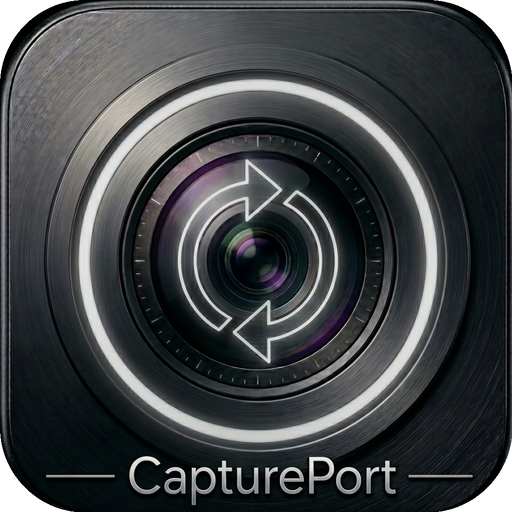
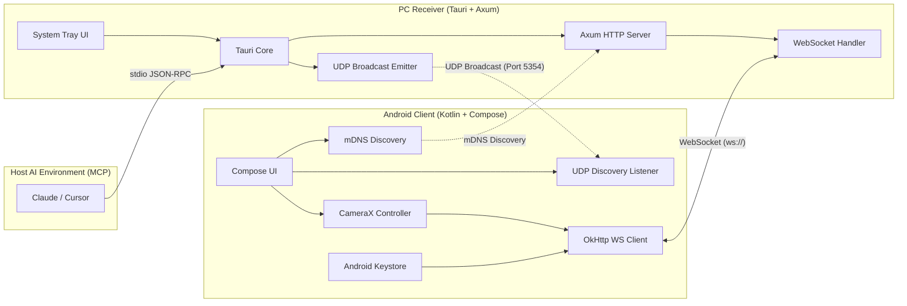
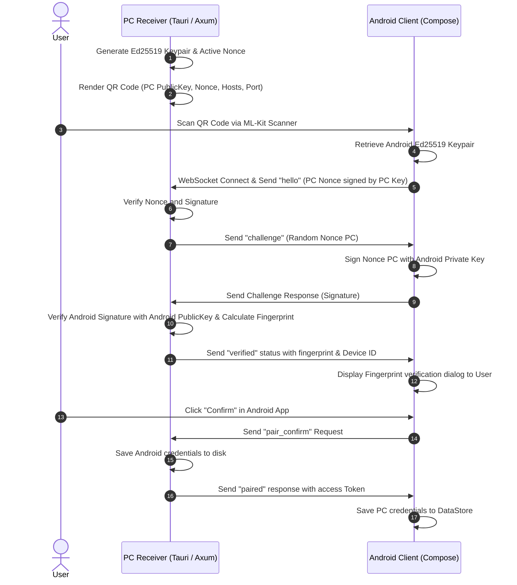

<h1 align="center">CapturePort</h1>

<p align="center">
  
</p>

<p align="center">
  <strong>Secure, cross-platform media and capture bridge linking Android devices to your desktop environment.</strong>
</p>

<p align="center">
  <a href="https://github.com/wyrtensi/CapturePort/actions/workflows/android-build.yml"></a>
  <a href="https://github.com/wyrtensi/CapturePort/actions/workflows/pc-build.yml"></a>
  <a href="LICENSE"></a>
</p>

CapturePort is a secure, cross-platform media and capture bridge linking Android devices to your desktop environment (Windows, macOS, Linux). It includes a built-in **Model Context Protocol (MCP)** server, enabling real-time visual streams and clipboard synchronization directly inside agent-driven local IDEs like **Cursor** and assistants like **Claude Desktop**.

---

### Architecture & Communication Flow

CapturePort operates on a decoupled client-server model over local network WebSocket connections, with security established via out-of-band mutual cryptographic authentication.

### System Topology

The following diagram outlines the relationship between the Compose-based Android application, the local Tauri 2 desktop receiver (which directly handles stdio JSON-RPC for MCP), the axum server layer, and the host AI environment:



### Cryptographic Mutual Pairing Flow

To ensure complete out-of-band trust validation, CapturePort relies on a **two-way mutual cryptographic verification** mechanism:



---

## Security Hardening

CapturePort is engineered from the ground up for strict local privacy:

- **Local Loopback Boundary**: The MCP server binds strictly to `127.0.0.1`. This isolates the model interface, preventing malicious execution or port scanning from external network nodes.
- **Path Traversal & RCE Defeated**: All inbound client parameters (such as `request_id`) undergo strict alphanumeric validation using `^[a-zA-Z0-9_\-]+$` matching. Directory traversal sequences (`..`, `/`, `\`) or shell injection operators are rejected, and violations trigger instant connection teardown.
- **Hardware-Backed Keys**: Jetpack Compose client key material is generated inside the **Android Keystore System** using `KeyProperties.DIGEST_NONE`. The private key remains secured in the hardware-isolated Trusted Execution Environment (TEE) or StrongBox, ensuring it cannot be extracted by malicious root entities.
- **Network Security Configuration**: Cleartext traffic is permitted globally via `network_security_config.xml` to enable connections to arbitrary LAN IPs over standard `ws://` WebSocket connections, since Android cannot dynamically restrict cleartext configurations to private CIDR ranges.
- **Escaped Command Interpolation**: OS clipboard commands (PowerShell for Windows, AppleScript/`osascript` for macOS) undergo character-escaping. Single quotes (`'`) are doubled in PowerShell, and double quotes (`"`) are fully escaped in AppleScript.

---

## Feature Guide

### Camera Capture Policies
- **Screen Only** ("Camera: screen only"): Captures photos or records video only while the Android app is visible on the screen.
- **Background** ("Camera: background"): *Note: Background capture is currently restricted by Android OS and CameraX lifecycle constraints.*

### Connection Route Modes
- **Local** ("Local only"): Forces the socket to only try LAN IP addresses.
- **Mixed** ("Mixed"): Sequentially tries all discovered local LAN IPs first, then falls back to the external hostname.
- **Internet** ("Internet only"): Bypasses LAN hosts entirely and directly connects to the configured external host and port.

### Receiver Controls
- **Snap Photo**: Shoots a photo using CameraX, downscales it to 1920px (long edge) with 80% JPEG quality, and sends it as a raw binary packet over the WebSocket stream, automatically placing it in the PC’s clipboard.
- **Record Video**: Records a H.264 video clip with audio, transfers it via a foreground service to the PC, and copies its file URL to the clipboard.
- **Gallery Upload**: Pushes selected photos/videos from the gallery directly to the PC clipboard.

---

## Model Context Protocol (MCP) Setup

CapturePort acts as an MCP server, empowering AI tools with vision (real-time camera feeds) and clipboard access on your machine.

### Claude Desktop Integration

Claude Desktop runs MCP servers locally over stdio pipes. Since the primary CapturePort process is built into the main desktop application, you can configure Claude Desktop to launch the CapturePort executable directly with the headless flag:

1. Locate or create your Claude Desktop configuration file:
   - **Windows**: `%APPDATA%\Claude\claude_desktop_config.json`
   - **macOS**: `~/Library/Application Support/Claude/claude_desktop_config.json`
2. Add the `captureport` entry to `mcpServers`:

```json
{
  "mcpServers": {
    "captureport": {
      "command": "C:\\Program Files\\CapturePort\\CapturePort.exe",
      "args": ["--mcp-stdio"],
      "env": {
        "RUST_LOG": "info"
      }
    }
  }
}
```

### Cursor Integration

Cursor connects to MCP servers using stdio pipes.

1. Open Cursor and navigate to **Settings** -> **Features** -> **MCP**.
2. Click **+ Add New MCP Server**.
3. Fill out the dialog with these parameters:
   - **Name**: `CapturePort`
   - **Type**: `command`
   - **Command**: `C:\Program Files\CapturePort\CapturePort.exe --mcp-stdio`
4. Click **Save**.

---

## Development Setup

Ensure you have installed Node.js (v20+), Rust stable, and the Android SDK.

### 1. Build and Run the PC Receiver

#### Install Linux System Dependencies
If you are compiling on Ubuntu/Debian:
```bash
sudo apt-get update
sudo apt-get install -y libwebkit2gtk-4.1-dev libappindicator3-dev librsvg2-dev patchelf build-essential curl wget file libssl-dev libgtk-3-dev libayatana-appindicator3-dev
```

#### Run Dev Server
```bash
cd pc
npm install
npm run tauri dev
```

### 2. Build and Run the Android Client

Make sure you have JDK 17 or JDK 21 configured (JDK 21 is recommended on newer systems to avoid Kotlin compiler daemon crashes with JDK 25) and run the following in your terminal:
```bash
cd android
./gradlew assembleDebug
```

---

## Automated Release Pipeline (CI/CD)

Every push or pull request on `main` initiates a dual-validation pipeline:

- **Android CI**: Validates Lint rules, runs JVM unit tests (`testDebugUnitTest`), and packages an unsigned production APK.
- **PC CI**: Executes Svelte type-checking (`npm run check`), Rust linting (`clippy`), and unit tests. On release tags (`v*`), a matrix build triggers to compile assets across three architectures:

| Platform | Package Format | Target Architecture | Generated Asset Name |
|---|---|---|---|
| **Windows** | MSI Installer | x86_64 | `CapturePort_{version}_x64_en-US.msi` |
| **macOS** | DMG Disk Image | Universal (Intel + Apple Silicon) | `CapturePort_{version}_universal.dmg` |
| **Linux** | Debian Package | x86_64 | `captureport_{version}_amd64.deb` |
| **Linux** | Portable AppImage | x86_64 | `captureport_{version}_amd64.AppImage` |
| **Android** | APK Package | ARM64 / Universal | `app-debug.apk` |

Both pipelines publish their corresponding artifacts directly to the same **GitHub Release Draft** upon tag triggers, providing a single consolidated distribution point. Note that the Android pipeline currently publishes the debug build APK.

---

## License

This project is licensed under the MIT License - see the [LICENSE](LICENSE) file for details.
