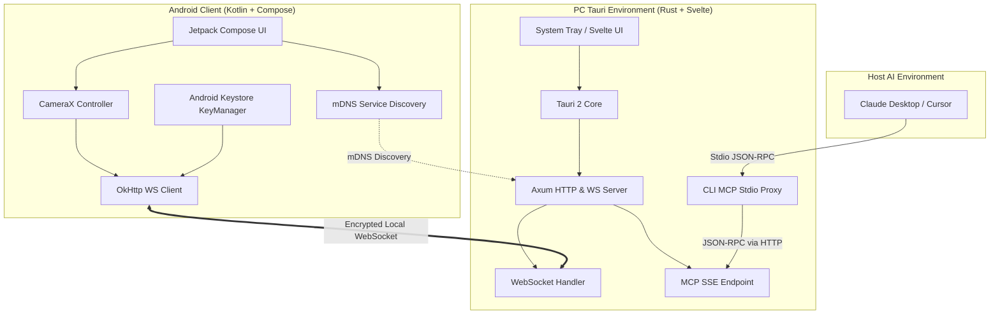

# CapturePort

[](https://github.com/wyrtensi/CapturePort/actions/workflows/android-build.yml)
[](https://github.com/wyrtensi/CapturePort/actions/workflows/pc-build.yml)
[](LICENSE)

CapturePort is a secure, cross-platform media and capture bridge linking Android devices to your desktop environment (Windows, macOS, Linux). It includes a built-in **Model Context Protocol (MCP)** server, enabling real-time visual streams and clipboard synchronization directly inside agent-driven local IDEs like **Cursor** and assistants like **Claude Desktop**.

---

## Architecture & Communication Flow

CapturePort operates on a decoupled client-server model over an encrypted local network connection.

### System Topology

The following diagram outlines the relationship between the Compose-based Android application, the local Tauri 2 desktop receiver, the axum server layer, and the host AI environment:



### Cryptographic Mutual Pairing Flow

To ensure complete out-of-band trust validation, CapturePort relies on a **two-way mutual cryptographic verification** mechanism:

```mermaid
sequenceDiagram
    autonumber
    participant PC as PC Receiver (Tauri / Axum)
    participant And as Android Client (Compose)

    PC->>PC: Generate Ed25519 Keypair & Challenge Nonce
    PC->>PC: Render QR Code with Host Port & PC PublicKey
    And->>PC: Scan QR Code via ML-Kit Scanner
    And->>And: Generate Android Ed25519 Keypair & Compute Fingerprint
    And->>PC: Connect via WebSocket & Send QR Nonce Signed with Android Key
    PC->>PC: Verify Android Signature using Android Public Key
    PC->>PC: Display Dialog prompting User to Accept/Deny Fingerprint
    Note over PC: User clicks "Allow" on Tauri Svelte GUI
    PC->>And: Send Pairing Accept Signed with PC Key
    And->>And: Verify PC Signature
    And->>And: Persist PC Credentials in DataStore
    PC->>PC: Persist Android Credentials on Disk
```

---

## Security Hardening

CapturePort is engineered from the ground up for strict local privacy:

- **Local Loopback Boundary**: The MCP server binds strictly to `127.0.0.1`. This isolates the model interface, preventing malicious execution or port scanning from external network nodes.
- **Path Traversal & RCE Defeated**: All inbound client parameters (such as `request_id`) undergo strict alphanumeric validation using `^[a-zA-Z0-9_\-]+$` matching. Directory traversal sequences (`..`, `/`, `\`) or shell injection operators are rejected, and violations trigger instant connection teardown.
- **Hardware-Backed Keys**: Jetpack Compose client key material is generated inside the **Android Keystore System** using `KeyProperties.DIGEST_NONE`. The private key remains secured in the hardware-isolated Trusted Execution Environment (TEE) or StrongBox, ensuring it cannot be extracted by malicious root entities.
- **Network Security Configuration**: Android cleartext traffic is disabled globally by default. CapturePort uses a target-specific `network_security_config.xml` that permits unencrypted traffic *solely* within private local subnets (RFC 1918 range: `192.168.0.0/16`, `10.0.0.0/8`, `172.16.0.0/12`) and loopback, safeguarding you against cleartext leaks over external WAN endpoints.
- **Escaped Command Interpolation**: OS clipboard commands (PowerShell for Windows, AppleScript/`osascript` for macOS) undergo character-escaping. Single quotes (`'`) are doubled in PowerShell, and double quotes (`"`) are fully escaped in AppleScript.

---

## Model Context Protocol (MCP) Setup

CapturePort acts as an MCP server, empowering AI tools with vision (real-time camera feeds) and clipboard access on your machine.

### Claude Desktop Integration

Claude Desktop runs MCP servers locally over stdio pipes. Since the primary CapturePort process operates as a background tray application, a high-performance Stdio Proxy client (`captureport-mcp`) handles communication:

1. Locate or create your Claude Desktop configuration file:
   - **Windows**: `%APPDATA%\Claude\claude_desktop_config.json`
   - **macOS**: `~/Library/Application Support/Claude/claude_desktop_config.json`
2. Add the `captureport` entry to `mcpServers`:

```json
{
  "mcpServers": {
    "captureport": {
      "command": "C:\\Program Files\\CapturePort\\captureport-mcp.exe",
      "env": {
        "RUST_LOG": "info"
      }
    }
  }
}
```

### Cursor Integration

Cursor connects to MCP servers using Server-Sent Events (SSE). The CapturePort desktop app hosts this server endpoint directly:

1. Open Cursor and navigate to **Settings** -> **Features** -> **MCP**.
2. Click **+ Add New MCP Server**.
3. Fill out the dialog with these parameters:
   - **Name**: `CapturePort`
   - **Type**: `SSE`
   - **URL**: `http://127.0.0.1:7878/mcp`
4. Click **Save**.

---

## Development Setup

Ensure you have installed Node.js (v20+), Rust stable, and the Android SDK.

### 1. Build and Run the PC Receiver

#### Install Linux System Dependencies
If you are compiling on Ubuntu/Debian:
```bash
sudo apt-get update
sudo apt-get install -y libwebkit2gtk-4.1-dev libappindicator3-dev librsvg2-dev patchelf build-essential curl wget file libssl-dev libgtk-3-dev libayatana-appindicator3-dev
```

#### Run Dev Server
```bash
cd pc
npm install
npm run tauri dev
```

### 2. Build and Run the Android Client

Make sure you have JDK 17 configured and run the following in your terminal:
```bash
cd android
./gradlew assembleDebug
```

---

## Automated Release Pipeline (CI/CD)

Every push or pull request on `main` initiates a dual-validation pipeline:

- **Android CI**: Validates Lint rules, runs JVM unit tests (`testDebugUnitTest`), and packages an unsigned production APK.
- **PC CI**: Executes Svelte type-checking (`npm run check`), Rust linting (`clippy`), and unit tests. On release tags (`v*`), a matrix build triggers to compile assets across three architectures:

| Platform | Package Format | Target Architecture | Generated Asset Name |
|---|---|---|---|
| **Windows** | MSI Installer | x86_64 | `captureport-pc_{version}_x64_en-US.msi` |
| **macOS** | DMG Disk Image | Universal (Intel + Apple Silicon) | `captureport-pc_{version}_universal.dmg` |
| **Linux** | Debian Package | x86_64 | `captureport-pc_{version}_amd64.deb` |
| **Linux** | Portable AppImage | x86_64 | `captureport-pc_{version}_amd64.AppImage` |
| **Android** | APK Package | ARM64 / Universal | `captureport-android-release-unsigned.apk` |

Both pipelines publish their corresponding artifacts directly to the same **GitHub Release Draft** upon tag triggers, providing a single consolidated distribution point.

---

## License

This project is licensed under the MIT License - see the [LICENSE](LICENSE) file for details.
